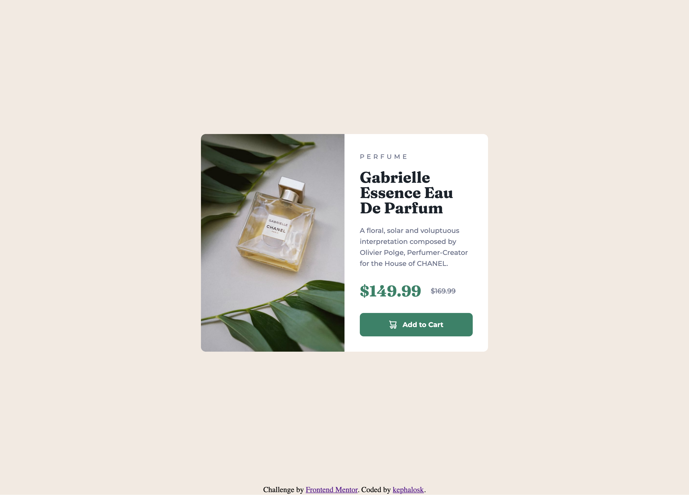
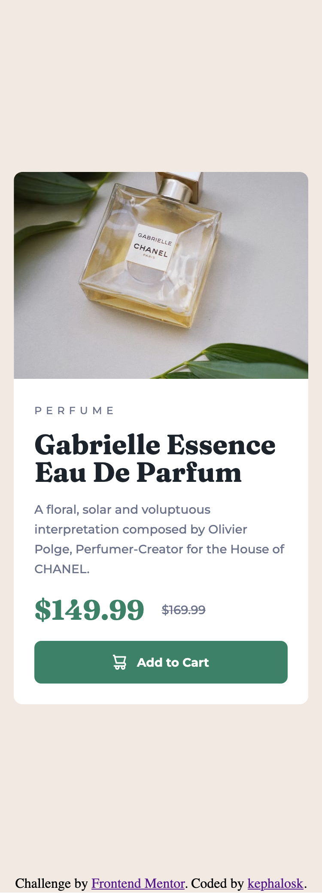

# Frontend Mentor - Product preview card component solution

This is a solution to the [Product preview card component challenge on Frontend Mentor](https://www.frontendmentor.io/challenges/product-preview-card-component-GO7UmttRfa). Frontend Mentor challenges help you improve your coding skills by building realistic projects. 

## Table of contents

- [Overview](#overview)
  - [Screenshots](#screenshots)
  - [Links](#links)
- [My process](#my-process)
- [Built with](#built-with)
- [Author](#author)

## Overview

### Screenshots

Desktop

Active State

Mobile

### Links

- Solution URL: [GitHub Repo](https://github.com/kephalosk/product-preview-card-component)
- Live Site URL: [GitHub Pages](https://kephalosk.github.io/product-preview-card-component/)

## My process

- download project files
- setup project
- check ux design
- recreate index.html
- create scss styles
- create scss classes
- add html structure
- open html in browser
- fix layout
- add screenshots
- update README
- clean up project
- upload solution

## Built with

- Semantic HTML5 markup
- SCSS custom properties
- Flexbox
- Grid
- Mobile-first workflow

## Author

- Website - [GitHub Account](https://github.com/kephalosk/)
- Frontend Mentor - [@kephalosk](https://www.frontendmentor.io/profile/kephalosk)